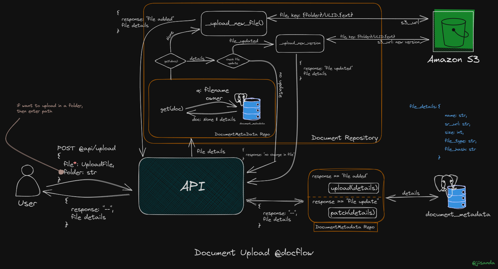
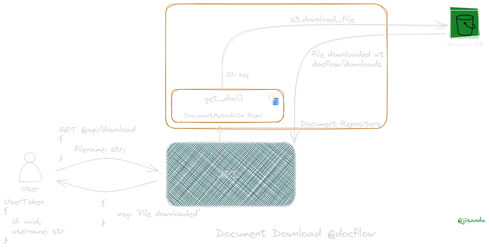
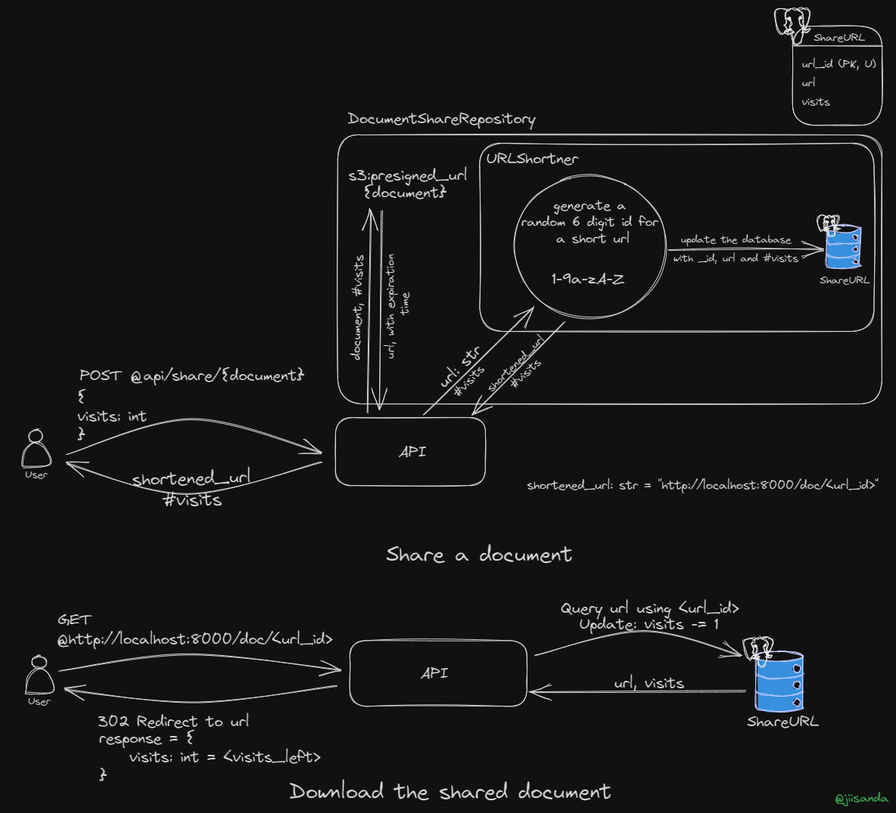
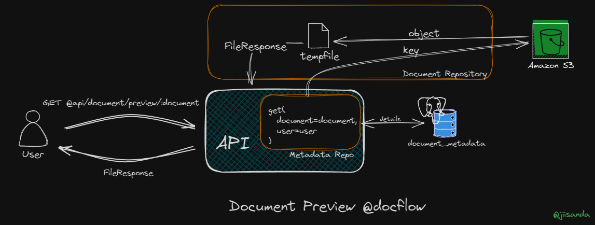

# DocFlow - Document Management API

<div align="center">
    <br>
</div>


DocFlow is a powerful Document Management API designed to streamline document handling, including seamless uploading, downloading, organization, versioning, sharing, and more.

## 🚀 Key Features

- 💡 Document Upload and Download
- 💡 Organization and Searching
- 💡 Versioning
- 💡 Sharing
- 💡 Authentication and Authorization
- 💡 Access Control List
- 💡 Deletion and Archiving
- 💡 Send file via Email
- 💡 Conversion to PDF
- 💡 Full Text Search
- 💡 Text Analysis and OCR

## 📖 API Documentation and Image
Explore the [API Documentation](https://documenter.getpostman.com/view/20984268/2s9YRGxUcp) for detailed information on how to use DocFlow's features.

Download docker image from [docker-hub](https://hub.docker.com/r/jiisanda/docflow).

Or just run
```commandline
docker pull jiisanda/docflow
```

## 🧩 Implementation Detail


| Features                         | Implementation Detail                                            |
|----------------------------------|------------------------------------------------------------------|
| Upload                           | [Detail](https://github.com/jiisanda/docflow#-document-upload)   |
| Download                         | [Detail](https://github.com/jiisanda/docflow#-document-download) |
| Organization/Searching a Doc     |                                                                  |
| Versioning                       |                                                                  |
| Sharing                          | [Detail](https://github.com/jiisanda/docflow#-document-sharing)  |
| Authorization and Authentication |                                                                  |
| Access Control List              |                                                                  |
| Deletion and Archiving           |                                                                  |
| Document Preview                 | [Detail](https://github.com/jiisanda/docflow#-document-preview)  |
| Send File via Email              |                                                                  |
| Conversion to PDF                |                                                                  |
| Full Text Search                 |                                                                  |
| Text Analysis and OCR            |                                                                  |


### 📤 Document Upload

Here's how documents are uploaded in DocFlow:



For a detailed explanation, visit the [Document Upload Documentation]().

### 📥 Document Download

Here's how a user can download a file in DocFlow.



For detailed explanation, visit the [Document Download Documentation](). 

### 📨 Document Sharing

Learn how to share documents in DocFlow:



For detailed instructions, visit the [Document Sharing Documentation]().

### 👀 Document Preview

Here's how preview of docs works in DocFlow.



For detailed instructions, visit the [Document Preview Documentation](https://github.com/jiisanda/docflow/blob/master/docs/features/preview.md)

## 📜 License

[](./LICENSE)

## 📧 Contact Us

For any questions or support, please [contact](mailto:harshjaiswal2307@gmail.com).

Enjoy using DocFlow to manage your documents seamlessly!
