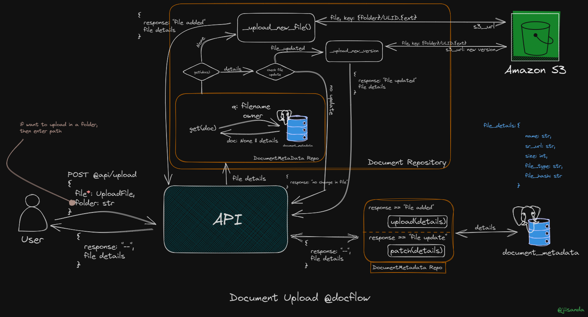
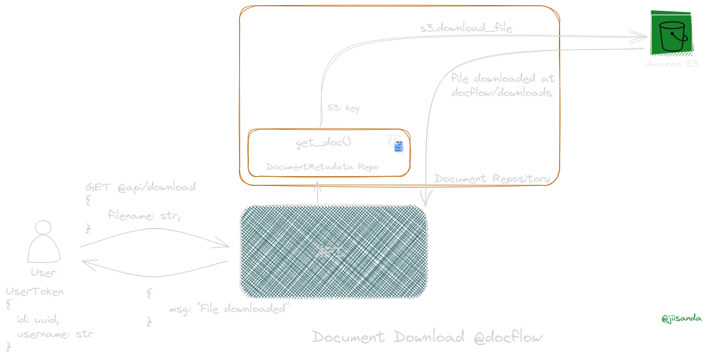
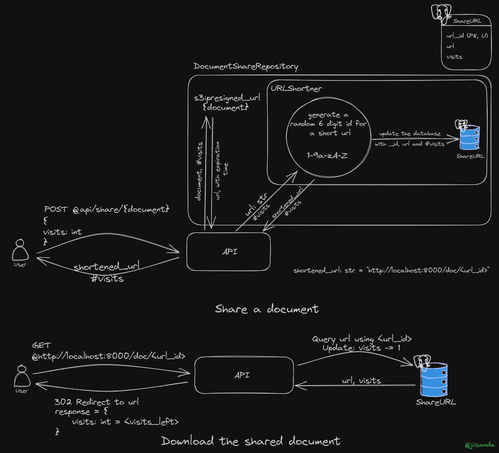
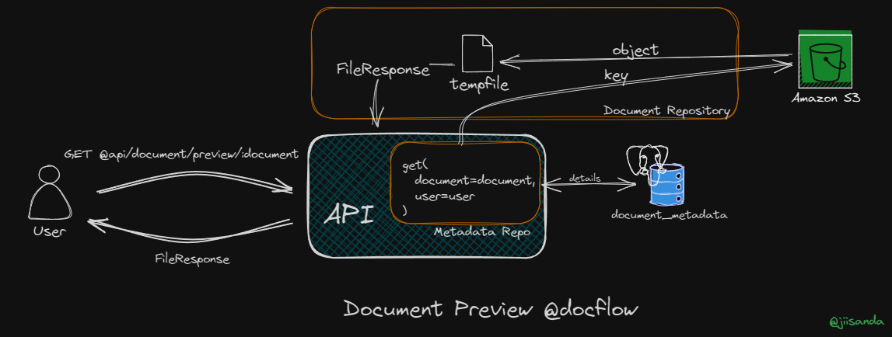

# DocFlow - Document Management API

<div align="center">
    <br>
</div>


DocFlow is a powerful Document Management API designed to streamline document handling, including seamless uploading, downloading, organization, versioning, sharing, and more.

## 😎 Upcoming Updates

- 🟨 Document Interactions - Adding Comments and Tags
- 🟨 Import documents from unread emails
- 🟨 Video Preview
- 🟨 Adding custom metadata fields to document
- 🟨 2-factor authentication
- 🟨 Storage quota per user? (Maybe to enable limit storage per user)
- 🟨 Bulk file importer

## 🚀 Key Features

- 💡 Document Upload and Download
- 💡 Organization and Searching
- 💡 Versioning
- 💡 Sharing
- 💡 Authentication and Authorization
- 💡 Access Control List
- 💡 Deletion and Archiving
- 💡 Document Preview
- 💡 Send file via Email


## 📖 API Documentation and Image

Explore the [API Documentation](https://documenter.getpostman.com/view/20984268/2s9YRGxUcp) for detailed information on how to use DocFlow's features.

Details about features and commands can be found [here](app/docs).

Download docker image from [docker-hub](https://hub.docker.com/r/jiisanda/docflow).

Or just run
```commandline
docker pull jiisanda/docflow:1
```

## 🔸 Setup Docflow 

Follow the steps outlined in the [setup.md](app/docs/setup.md) file.

## 🧩 Implementation Detail


| Features                         | Implementation Detail                                            |
|----------------------------------|------------------------------------------------------------------|
| Upload                           | [Detail](https://github.com/jiisanda/docflow#-document-upload)   |
| Download                         | [Detail](https://github.com/jiisanda/docflow#-document-download) |
| Sharing                          | [Detail](https://github.com/jiisanda/docflow#-document-sharing)  |
| Document Preview                 | [Detail](https://github.com/jiisanda/docflow#-document-preview)  |


### 📤 Document Upload

Here's how documents are uploaded in DocFlow:



For a detailed explanation, visit the [Document Upload Documentation](app/docs/features/upload.md).

### 📥 Document Download

Here's how a user can download a file in DocFlow.



For detailed explanation, visit the [Document Download Documentation](). 

### 📨 Document Sharing

Learn how to share documents in DocFlow:



For detailed instructions, visit the [Document Sharing Documentation](app/docs/features/sharing.md).

### 👀 Document Preview

Here's how the preview of docs works in DocFlow.



For detailed instructions, visit the [Document Preview Documentation](app/docs/features/preview.md)

## 📜 License

[](./LICENSE)

## 📧 Contact Us

For any questions or support, please [contact](mailto:harshjaiswal2307@gmail.com).

Test DocFlow to manage documents seamlessly!
