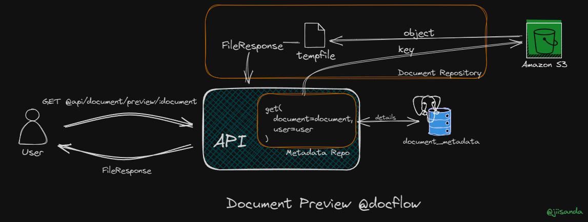

# Preview in Docflow

Let's see how the preview feature of DocFlow works. 🚀

- 🎯 Endpoint:
`GET /v2/preview/:document`
- ⚙️ Params:
`{document: <docuent_id_or_name>}`
- 🔐 Authorization:
`Bearer <token>`

➰ cURL: 
```shell
curl --location 'localhost:8000/v2/preview/:document' \
--header 'Authorization: Bearer <token>'
```

Here in Preview we use two important models, `fastapi.response`'s `FileResponse` amd `tempfile`'s `NamedTemporaryFile`.

`FileResponse` is used to return files.

`NamedTemporaryFile` is a function in Python's `tempfile` module that creates a temporary file with a unique name in the 
system's default location for temporary files.
This function returns a file-like object that can be used in a similar way to other file objects.

Here is the brief explanation on how it works:
- When we call `NameTemporaryFile()`, it creates a new file in you system's temporary directory.
- The temporary file is opened in binary mode (`wb+`) by default, and it can be read from and written to like any other
file object.
- The temporary file is deleted as soon as it is closed. This is controlled by the `delete` parameter, which is `True` 
by default. This is important to set it `True`, as if not done then it could fill up the server's storage.


In our case, we have set `delete=False`, and we have override the `FileResponse` to add a `__del__` method, which
will be deleting the file once the response is sent (see: `api/dependencies/repositories`). 
Issue we were experiencing is because the temporary file was getting deleted as soon as it's closed, which 
happens when `with` block is exited. We were getting the following error `RuntimeError: File at path /tmp/tmpuc5ru1oh.png 
does not exist.` And this is expected behaviour when `delete=True` is set in `tempfile.NamedTemporaryFile`.


The following figure describes how the Preview in DocFlow works. 



DocFlow allows, preview of only two media types, `image/` and `application/pdf`.
