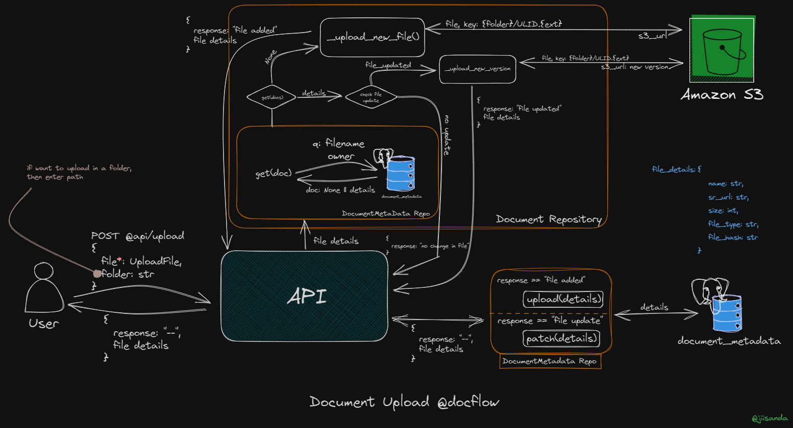

# Document Upload in DocFlow

- 🎯 Endpoint:
`POST /v2/upload`
- ⚙️ Params:
`{
    folder: <folder_name>,
    file=@"/path/to/file
}`
- 🔐 Authorization:
`Bearer <token>`

➰ cURL:
```commandline
curl --location 'localhost:8000/v2/upload?folder=' \
--header 'Content-Type: multipart/form-data' \
--header 'Accept: application/json' \
--header 'Authorization: Bearer <token>' \
--form 'file=@"/path/to/file"'
```

So the following API, upload the file to s3 and adds the metadata to the database, so how this works:

The endpoint returns a `DocumentMetadataRead` object, which contains metadata about the uploaded document, or a 
Dict[str, str] object in case of an error or other non-standard situation. The response of `DocumentRepository.upload`
has two cases, `file_added` and `file_updated`. `file_added` is the case when the uploaded file does not exist for that
user. And `file_updated`, when the file with the same name, exits and the new version of the file is added (details about
versioning is mentioned [here]()).


### Code Explanation

```python
1.     async def upload(self, metadata_repo, user_repo, file: File, folder: str, user: TokenData) -> Dict[str, Any]:
2.         """
3.         Uploads a file to the specified folder in the document repository.
4. 
5.         Args:
6.             @param metadata_repo: The repository for accessing metadata.
7.             @param user_repo: The repository for accessing user information.
8.             @param file: The file to be uploaded.
9.             @param folder: The folder in which the file should be uploaded.
10.            @param user: The token data of the user.
11.
12.        Returns:
13.            @return: A dictionary containing the response and upload information.
14.
15.        Raises:
16.            HTTP_400: If the file type is not supported.
17.        """
18.
19.        file_type = file.content_type
20.        if file_type not in SUPPORTED_FILE_TYPES:
21.            raise HTTP_400(
22.                msg=f"File type {file_type} not supported."
23.            )
24.
25.        contents = file.file.read()
26.
27.        doc = (await metadata_repo.get(document=file.filename, owner=user)).__dict__
28.        # hash of the file uploaded to check if change in file
29.        new_file_hash: str = await self._calculate_file_hash(file=file)
30.        if "status_code" in doc.keys():
31.            # getting document irrespective of user
32.            if get_doc := (await metadata_repo.get_doc(filename=file.filename)):
33.                get_doc = get_doc.__dict__
34.                # Check if logged-in user has update access
35.                logged_in_user = (await user_repo.get_user(field="username", detail=user.username)).__dict__
36.                if (get_doc["access_to"] is not None) and logged_in_user["email"] in get_doc["access_to"]:
37.                    if get_doc['file_hash'] != new_file_hash:
38.                        # can upload a version to a file...
39.                        print(f"Have update access, to a file... owner: {get_doc['owner_id']}")
40.                        return await self._upload_new_version(
41.                            doc=get_doc, file=file, contents=contents, file_type=file_type,
42.                            new_file_hash=await self._calculate_file_hash(file=file),
43.                            is_owner=False
44.                        )
45.                else:
46.                    return await self._upload_new_file(
47.                        file=file, folder=folder, contents=contents, file_type=file_type, user=user
48.                    )
49.            return await self._upload_new_file(
50.                file=file, folder=folder, contents=contents, file_type=file_type, user=user
51.            )
52.
53.        print("File already present, checking if there is an update...")
54.
55.        if doc["file_hash"] != new_file_hash:
56.            print("File has been updated, uploading new version...")
57.            return await self._upload_new_version(doc=doc, file=file, contents=contents, file_type=file_type,
58.                                                  new_file_hash=new_file_hash, is_owner=True)
59.
60.        return {
61.            "response": "File already present and no changes detected.",
62.            "upload": "Noting to update..."
63.        }
```

This the biggest chunk of code we have in docflow and handles multiple conditions, and cases.

#### Parameters:
```
file: File  -> File to be uploaded
folder: str -> Folder to upload in...
```

From line 19-23, we are checking if the file type is supported for upload. 

Line 27, gets the document if the document is already present in the database of the logged-in user. It returns the
following response if new file is uploaded.
```json
{
  "status_code": 409, 
  "detail": "No Document with <file_name>", 
  "headers": null
}
```
And below is the response if the file is already present.
```json
{
    "owner_id": "<ulid>",
    "name": "<file_name>",
    "s3_url": "<s3_link>",
    "created_at": "2023-12-24T07:05:51.971123Z",
    "id": "<uuid>",
    ...
}
```

Line 29, calculates the hash of the file uploaded, to check if there is any change in file, if the file with same name
is uploaded. 

So in line 30, we check if we have `status_code`, in the response of doc, if we does then it means the user does not have 
the document with the following name, which brings us to next case, i.e., have another user given the logged-in user permission
to update the file, so we check that from line 31-39, and if the user had permissions, then uploads the new version with line 
40 (using `_upload_new_version`), or uploads a new file (using `_upload_new_file`). 

Now if the file is already present, and we get some doc response from line 27, then we check if the file is updated if yes,
upload a new version (using `_upload_new_version`) else, return 
```json 
{
  "response": "File already present and no changes detected.", 
  "upload": "Noting to update..."
}
```

#### Returns:
The upload function returns one of the few things:

A json response, with `"response"` as the key, with value `"file updated"`, if new version of file is uploaded, `"file added"`,
if new file is added. along with the metadata of the uploaded file.

That's too much to handle for one method, I know but will try to improve the quality of the upload functionality.

The following is the figure explaining the complete flow:



***